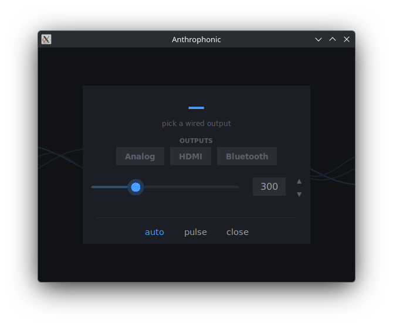

# Anthrophonic

> Play the same audio on **several outputs at once** (speakers, HDMI, Bluetooth) on
> Linux/PipeWire, with **per-output latency sync** so Bluetooth doesn't lag behind.
>
> Reproduce el mismo audio en **varias salidas a la vez** (altavoces, HDMI, Bluetooth) en
> Linux/PipeWire, con **sincronización de latencia** para que el Bluetooth no vaya desfasado.

UI language auto-detects from the system locale (Spanish if `$LANG` starts with `es`, English otherwise).



---

## 🇬🇧 English

### What it does
PipeWire can play several outputs at once via a central *null-sink* and one *loopback* per
output. Problem: Bluetooth adds ~150-300 ms of delay (A2DP decode + headset buffer) → echo
against wired speakers. This tool:

- Toggle each output with colored buttons (blue = active).
- Delays wired outputs to align them with Bluetooth.
- **auto**: reads the BT latency PipeWire knows and applies the delay, learning the headset's
  "hidden" latency that PipeWire can't see.
- **test pulse**: sharp click train to fine-tune by ear.

### Requirements
- PipeWire (with `pipewire-pulse`) — `pactl`, `pw-dump`
- `paplay` (`pulseaudio-utils`)
- Python 3 + `numpy`
- Tkinter (`python3-tk`)

### Install
```bash
./install.sh        # install
./install.sh --uninstall
```

### Usage
1. Open **Anthrophonic**.
2. Enable the outputs you want (blue chips).
3. Hit **auto** to sync, or tune manually with the slider + **pulse**.

---

## 🇪🇸 Español

### Qué hace
PipeWire deja sonar varias salidas a la vez creando un *null-sink* central y un *loopback*
por cada salida. El problema: el Bluetooth añade ~150-300 ms de retardo (decodificación A2DP
+ buffer del casco) → eco respecto a los altavoces. Esta herramienta:

- Activa/desactiva cada salida con botones de color (azul = activa).
- Retrasa las salidas de cable para cuadrarlas con el Bluetooth.
- **auto**: lee la latencia que PipeWire conoce del BT y aplica el retardo, aprendiendo el
  retardo "oculto" del casco que PipeWire no ve.
- **pulso de prueba**: tren de clics nítidos para afinar a oído.

### Requisitos
- PipeWire (con `pipewire-pulse`) — `pactl`, `pw-dump`
- `paplay` (paquete `pulseaudio-utils`)
- Python 3 + `numpy` (para generar el pulso de prueba)
- Tkinter (`python3-tk`)

### Instalar
```bash
./install.sh
```
Copia el script a `~/.local/bin/` y crea el lanzador en el menú. Para desinstalar:
`./install.sh --uninstall`.

### Uso
1. Abre **Anthrophonic**.
2. Activa las salidas que quieras (chips azules).
3. Pulsa **auto** para sincronizar, o ajusta a mano con el slider + **pulso**.

---

## How it works
See [docs/arquitectura.md](docs/arquitectura.md).

## Status
Working. Pending items in [ROADMAP.md](ROADMAP.md).

## License
[MIT](LICENSE).
